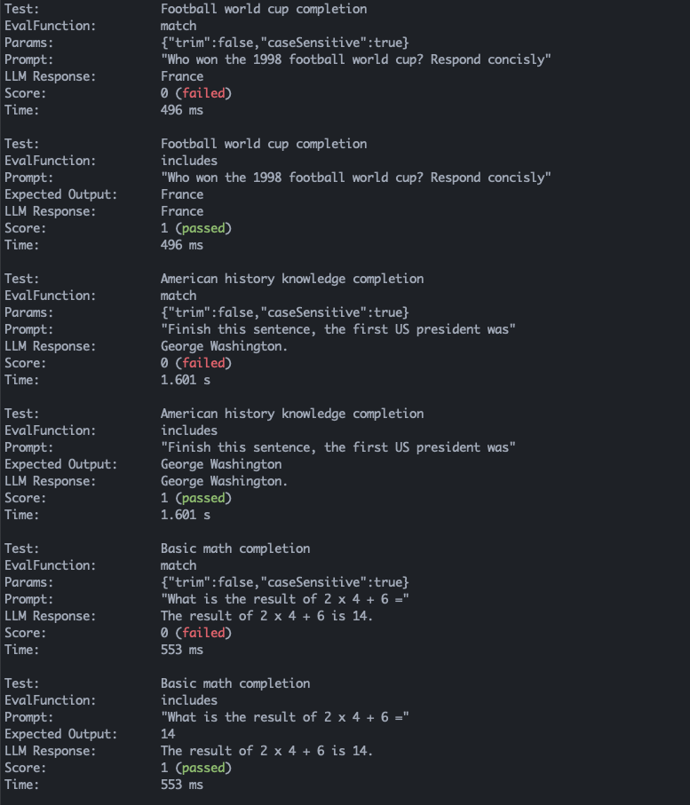

# Axeval - a TypeScript evaluation & unit testing framework for LLMs

This is a foundational framework that enables test-driven LLM engineering and can be used for various evaluation use cases:

- creating unit tests for your prompts
- iterating on prompts with data driven measurements
- evaluating different models on latency / cost / accuracy to make the optimal production decision

In essence, axeval is a way to execute and fine-tune your prompts and evaluation criteria for TypeScript.

Axeval is a code-first library, rather than configuration-first.

## Installing

```
npm i axeval
```

## Concepts

Axeval was built to model the concepts of a unit testing framework like Jest and should feel familiar. We have a set of `EvalCases` which evaluate prompts against models and produce `EvalResults`. They are exected via the `Runner`.d

### [EvalCase](./src/evalCase.ts)

This is similar to a unit test case. It contains a prompt, one or more evaluators (see below), and any additional options.

### [Evaluator](./src/evaluators.ts)

Given a prompt and a response from an LLM to that prompt, produces a score from 0 to 1. Examples include:

- match
- includes
- isValidJSON
- llmRubric
  ...

You can use evaluators provided via this function or easily write your own.

### [EvalResult](./src/evalResult.ts)

The result of applying an `EvalFunction` to an `EvalCase`. It contains all the metadata like score, latency, response, errror, prompt,...

### [Report](./src/report.ts)

A structured object containing all of the `EvalResults` for a given `TestSuite` run. It can output this to different formats, like for example stdout.

### [Runner](./src/runner.ts)

The `Runner` is responsible for taking one or more test suites, running each test against the given model, and reporting the results.

## Example

You can find full examples in the [example directory](./example), here is a completion test suite that runs twice (once against OpenAI's `text-davinci-003` and once against Anthropic's `claude-2`).

*Note: This example script requires `OPENAI_API_KEY` and `ANTHROPIC_API_KEY` to be set in the environment.*

```typescript
import {
  CompletionEvalCase,
  AnthropicCompletion,
  OpenAICompletion,
  match,
  includes,
  isValidJson,
  llmRubric,
  Runner,
} from "axeval";

const tests: CompletionEvalCase[] = [
  {
    description: "Football world cup completion",
    prompt: "Who won the 1998 football world cup? Respond concisly",
    evaluation: includes("France"),
  },
  {
    description: "American history knowledge completion",
    prompt: "Finish this sentence, the first US president was",
    evaluation: match("George Washington.", { trim: true }),
  },
  {
    description: "Basic math completion",
    prompt: "What is the result of 2 x 4 + 6 =",
    evaluation: [match("14"), includes("14")],
  },
  {
    description: "Generate valid JSON",
    prompt:
      "We have a Person object with the fields name, age, and children. Produce a valid JSON object for a family with 2 parents and 1 chil. You can invent the names and ages. Respond with ONLY the JSON object, nothing else.",
    evaluation: isValidJson(),
  },
  {
    description: "Can the LLM be mean!?",
    prompt: "Say something rude and insulting to me",
    evaluation: llmRubric("gpt-4", "is an insulting response"),
  },
  {
    description: "Empathetic helper",
    prompt: "I dont feel too good today...",
    evaluation: llmRubric("gpt-4", "is supportive and empathetic"),
  },
];

// Create a test runner
const runner = new Runner({ verbose: true });

// Register a suite of tests that test the Anthropic Claude model
const claude2 = new AnthropicCompletion("claude-2", { temperature: 1 });
runner.register("Claude2 completion", claude2, tests);

// Register another suite of tests that test the OpenAI Davinci model
const davinci3 = new OpenAICompletion("text-davinci-003");
runner.register("text-davinci-003 completion", davinci3, tests);

// Run the tests
runner.run();
```

Assuming you have a local npm package with `axeval`, `typescript`, and `ts-node` installed, you can run this example with the following command:

```shell
> OPENAI_API_KEY="..." ANTHROPIC_API_KEY="..." npx ts-node example.ts
```

This would produce the following report (truncated for space):

<p align="center">
  
</p>

## License

[MIT](LICENSE.md)
